# LINUX PRACTICE PROJECTS

## Prerequisites 

- Knowlegde of linux basic commands

- linux command line interface 

# File Manipulation 

1. ### Sudo Command 

The "sudo" command in linux stands for "superuser do". it is used to execute commands with administrative or root privilages. By using sudo before a command, you can temporarily elevate your user privilages to perform tasks that require administrative access. 

when you run a command with "sudo", you will be prompted to enter your password. After authentication  and if your user account has the necessary permissions, the command will be executed with elevated privileges.

Here is the general syntax :

`sudo (command e.g apt upgrade)` 

Then it becomes 

`sudo apt upgrade`

2. ### pwd command 

The pwd command stands for "Print Working Directory". 
When you run the pwd command, it displays the current directory or folder you are in, showing the full absolute path to that directory. This can be helpful for keeping track of your current location within the file system.

`pwd`

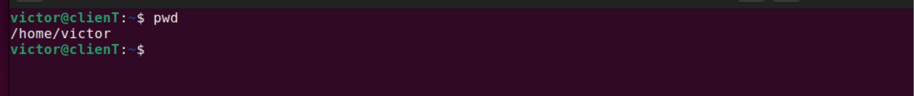

3. ### cd command

The "cd command" is used to change the current working directory. it allows you to navigate through the file system and switch to different directories. 

For example if you want to switch to a new directory let's say Desktop, then the "cd" command becomes 

`cd Desktop/`

4. ### ls command 

The "ls" command is used to list the files and directories in a dierectory. It provides information about the files and directories such as thier names, permissions, size and modification timestamps.

`ls`

`ls Desktop/`

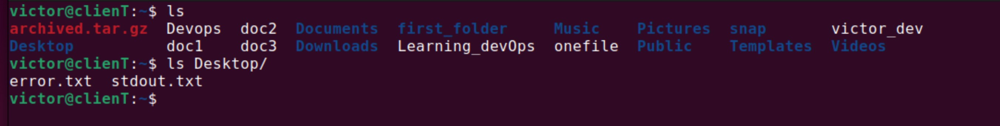

`ls -R`

shows all the files in the subdirectories.

`ls -a`

shows all the hidden files in addition to the visible ones.

`ls -lh`

shows the file sizes in easily readable formats, such as MB, GB,GB.

5. ### cat command

The cat command, short for "concatenate," is a commonly used command-line utility in linux. It is primarily used to display the contents of one or more text files in the terminal or to concatenate and combine multiple files into a single file.

To run the cat command type cat followed by file name and its extension

`cat Devops`

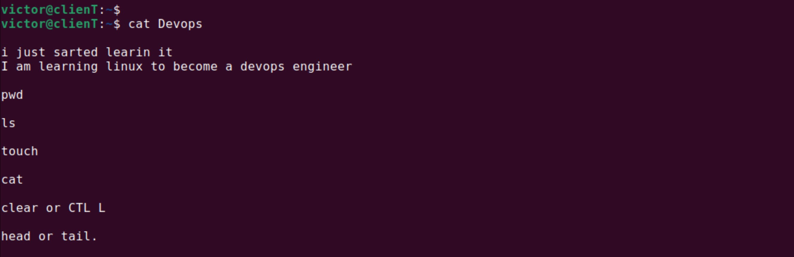

6. ### cp command 

 It is used to copy files and directories from one location to another. The basic syntax of the cp command is as follows:

 `cp doc1 /home/victor/Documents`

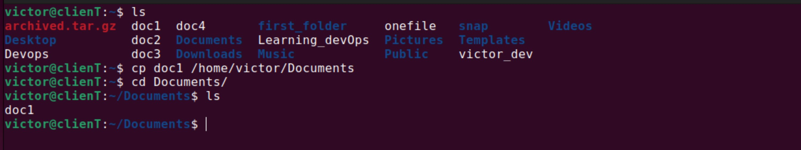

To copy files to a directory, enter the file names followed by the directoory: follow this format below

`cp doc1 doc2 doc3 doc 4 /home/victor/Documents`

To copy an entire directory, pass the -R flag before typing the source directory, followed by the destination directory: 

`cp -R /home/victor/Documents /home/victor/Documents_backup`

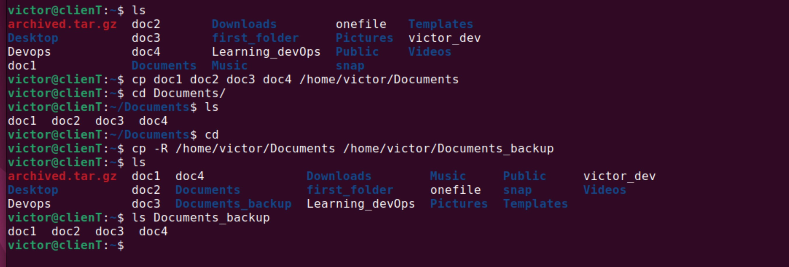

7. ### mv command 

 It is used to move or rename files and directories from one location to another. The mv command is also often used for renaming files and directories because moving a file to a different location with a new name effectively renames it. The basic syntax of the mv command is as follows:

` mv Documents_backup /home/victor/Onefile`

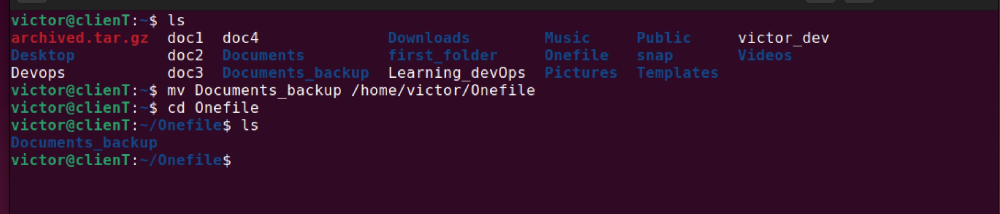

mv command can also be used to rename file :

`mv Documents_backup Documents_data`

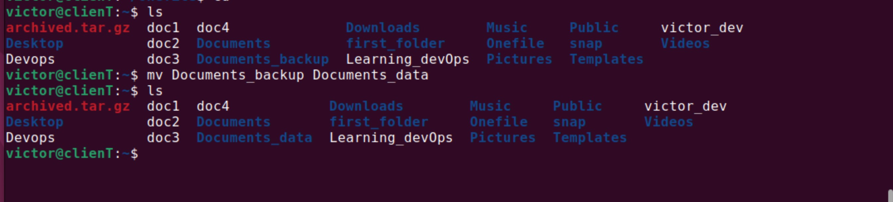

8. ### mkdir command 

The mkdir command is a command-line utility used to create new directories (folders). it canslo be used to make multiple directories and the user executing this command must have the right privilege to make new directory in the parent folder otherwise will recieve a permission den ied error. 

`mkdir music`

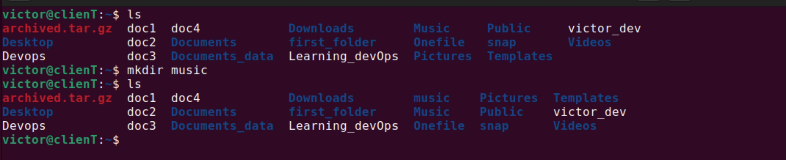

you can also make a new directory called songs inside music, use this command below :

`mkdir music/songs`

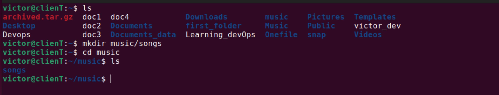

9. ### rmdir command 

It is specifically designed to remove directories that do not contain any files or subdirectories. Also have in mind that user running this command should have sudo privileges in the parent directory.

`rmdir -p music/songs`

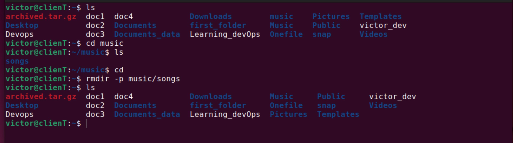

10. ### rm command
The rm command is used to delete files within a directory and also make sure that the user running this command has the write permissions 

`rm doc1`

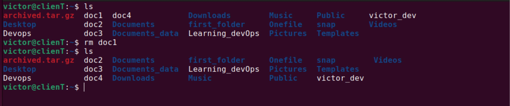

also to remove multiple files, 

`rm doc2 doc3 doc4`

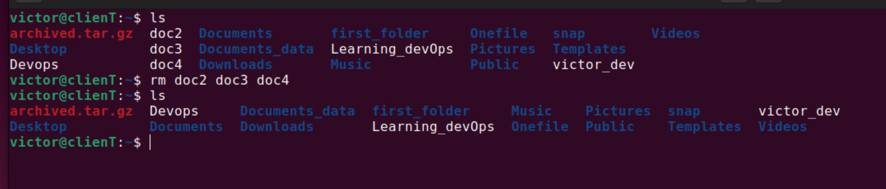

11. ### touch command 

this command (touch command) allows you to create an empty file or generate and modify a timestamp in linux command line. 

for example lets create "doc1" file. 

`touch doc1`

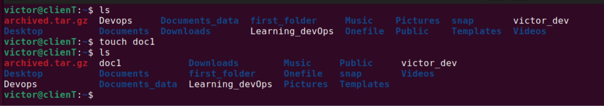

12. ### locate command 

"locate command" is used to find a file in the database system and in the case even if we don't remember the exact name we can add -i argument turn the case sensitivity.

`locate -i devops` 

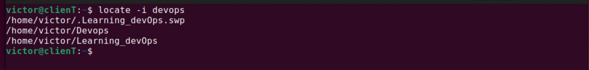

13. ### find command 

find comand is used to search for files within a specific direrctory and perform subsequent operations.

`sudo find /home -name Devops`

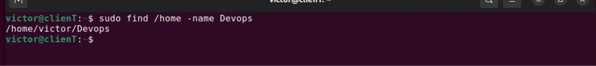

14. ### grep command 

this command lets you find a word by searching through all the texts in a specific file. 

15. ### df command 

df command is used to view the disk space usage, shown in percentage and kilobyte (KB). when df is used with the -h argument , it prints the result in human-readable format as seen below :

`df -h`

16. ### du command 

du stands for disc usage and it is used to check how much space a file or directory takes up, this can help to identify which part of the system uses the storage excessively.

`du /home/victor/Devops`

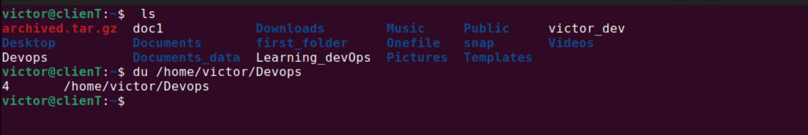

17. ### head command 

The head command is used to view the first lines of a text file. Adding an options lets you determine the number of lines to be shown.

`head Devops`

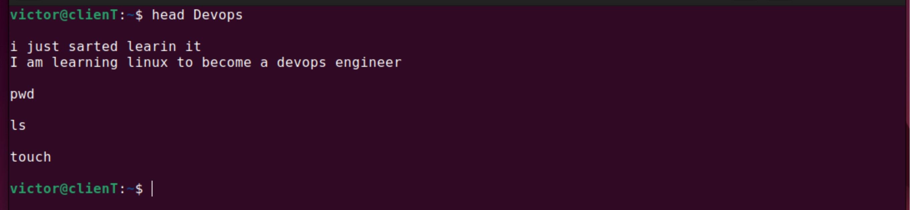

18. ### tail command 
tail commad is used to diplay the last lines of a file. You can use this to check weather a file has new data or to read error messages.

`tail Devops`

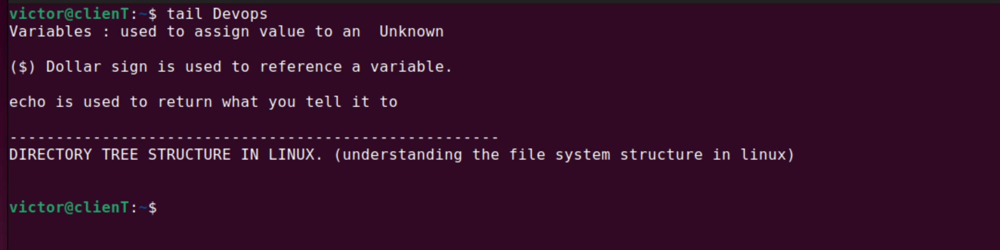

19. ### diff command

diff is the short for difference, the diff command compares two contents of a fileline by line and after analyzing them it will dispaly the parts that do not match.

`diff  Devops Learning_devops`

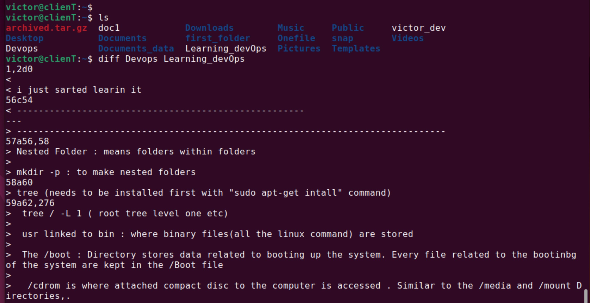

21. ### tar command 
this command is used to archive multiple files into TAR file -a common linux format similar to Zip, with optional compression.

`tar -cvf `

`tar -cf Devopsarchive.tar /home/victor`

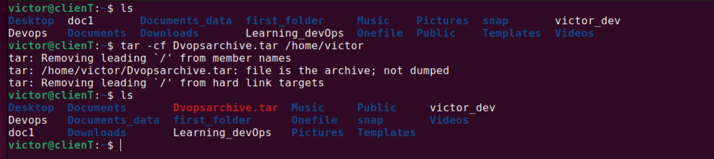

# File Permissions 

21. ### chmod command 

chmod is a command that modifies a file or directory's permissions like raed, write, and execute permissions.

for example lets change the permission of two files (Devops and victor_dev) to -rwxrwxrwx this means that the numeric value is 777:

`chmod 777 Devops victor_dev`

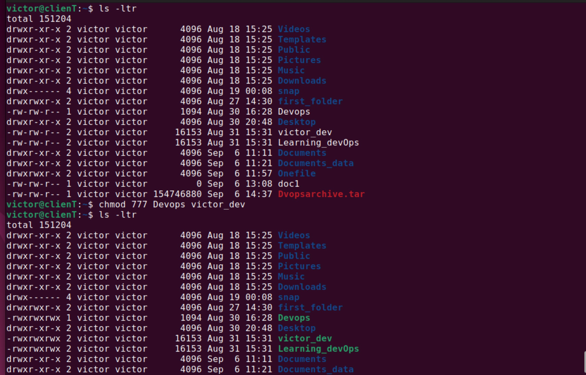

22. ### chown command 

"chown" which stands for "change ownership" lets us change the ownership of a file, directory, or also symbolic link to a specific username.

23. ### jobs command 

this command displays all the running processes along with thier statuses.

`jobs`

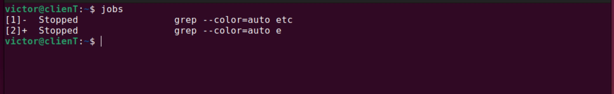

24. ### kill command 

this is used to terminate an unreposive program mannually and also bear it in mind that to kill a program, you must know its process identification number(PID).

If you don't know the PID, run the command below to display jobs currently on your system with thier PID

`ps ux`

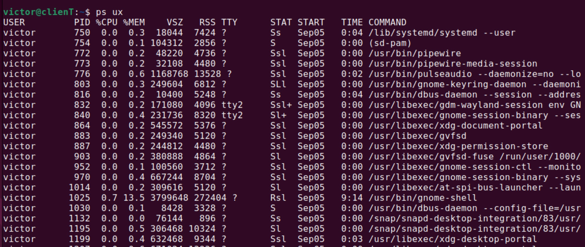

After knowing what signal to use and the program's PID you can use the following syntax 

`kill {signal_option} pid` 

example : 

`kill SIGTERM 1025 `

25. ### ping command 

this is a linux command that is used in checking weather a network or server is reachable. We can use its function to troubleshhot various connectivity issues.

`ping google.com`

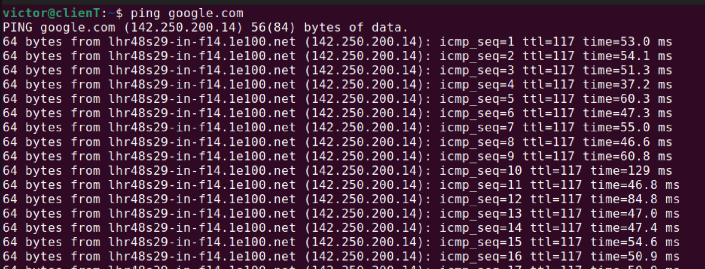

26. ### wiget command 

this command lets you download files online from the internet.

`wiget https://wordpress.org/lates.zip`

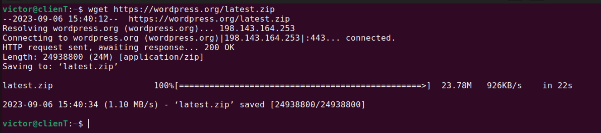

27. ### uname command

this will print the detial information about your linux system and hardware.

`uname -a`

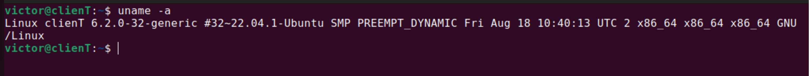

28. ### top command 

this command will display all the running processes and dynamic real-time view of the current system and with this we can identify and terminate process that may use too many systme resources.

`top`

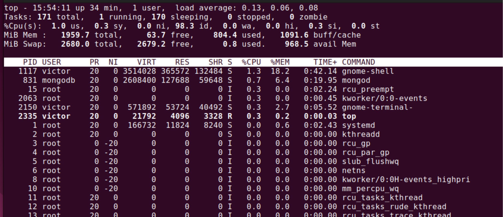

29. #### history command

this command will list up to 500 previously executed commands, allowing you to reuse them without re-entering. Also note that only users with sudo privilege can execute this command. 

`history`

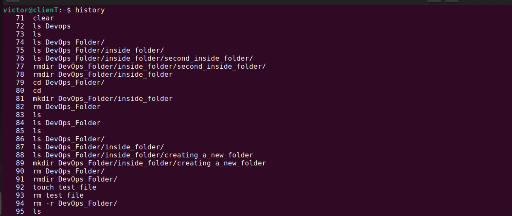

30. ### man command 

this command displays user manual of any coammnads or utilities you can runin terminal, including the name , description and options 

`man ls`

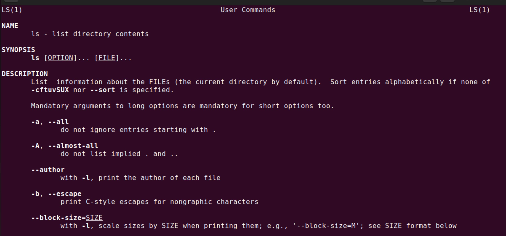

31. ### echo command 

echo command is used to dispplay text or variables on the command line. It is commonly used for printing messages, displaying variables values, or generating output. 

`echo victor`

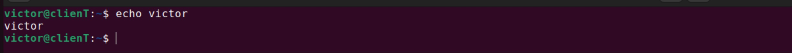

32. ### zip,unzip commands

zip command is used to compress your files into a ZIP file, a universal formal commonly used on linux. it also automatically choose the best compression ratio. 

`zip archive.zip doc1`

`unzip archive.zip` 

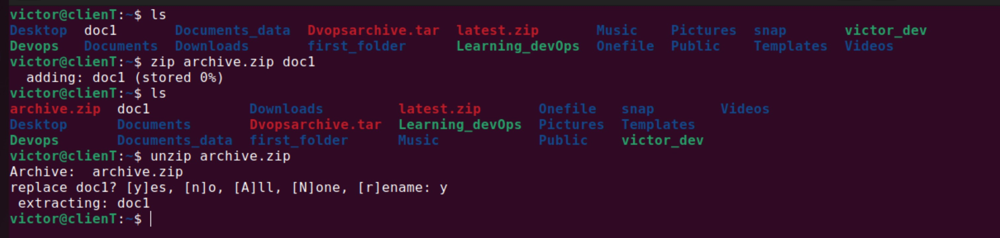

33. ### hostname command 

this command enables us to know the system's hostname. we can execute it with or without an option. 

`hostname` 

with an option 

`hostname -1`

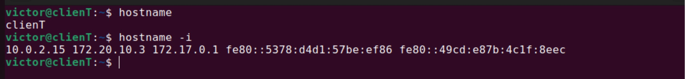

34. ### useradd, userdel commands

useradd is used to create or add new user account, while userdel is used to remove account. Also passwd command allows you to add a password and only those wkith root privileges or sudo can run the useradd or userdel command 

`sudo useradd -m Paul`

`sudo passwd Paul`

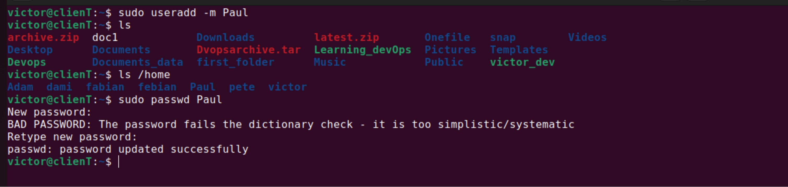

35. ### apt-get command 

This command is used to install, upgrade, configure, and manage software packages on your system. It is a tool for handling Advanced Package Toll (APT) libraries. To run this command , you must use the sudo or have or be a user that has root privileges. 

`apt-get`

`sudo apt-get install sudo`

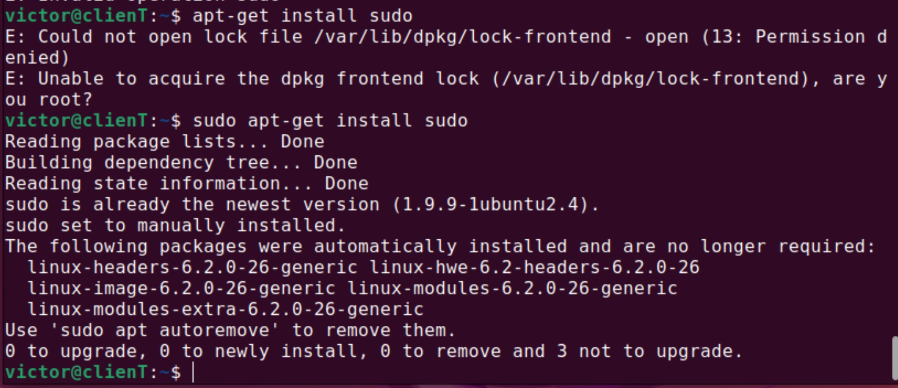

36. ### nano, vi, jed commands

these commands allows users to edit and manage file. nano and vi come with the operating system, while jed has to be install.

Lets take for instance that we want to edit a file called Devops :

`nano Devops`

`vi Devops`

37. ### alias, unalias commands 

this command allows us to create a shortcut with same functionality as a command, file name, or text. when executed, it instructs the shell to replace one string with another. 

`alias k=' kill`

`unalias k`

38. ### su command 

su command which stands for switch user is used to switch from one user to another user thereby allowing us to run program as a different user. it also changes the administrative account in the current log-in session. 

`su Paul`

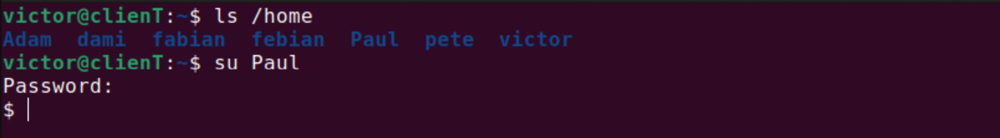

39. ### htop command

The htop command is a real-time system monitoring tool for Unix-like operating systems, including Linux and macOS. It provides an interactive and dynamic view of your system's performance, allowing you to monitor processes, system resources, and other important system information in a user-friendly, color-coded interface.

40. ### ps command 

 this a command line utility that provides information about currently running processes. It displays a list of processes that are running on the system, along with various details about each process, such as its process ID (PID), terminal, CPU and memory usage, and more.

` ps`

`ps -T`

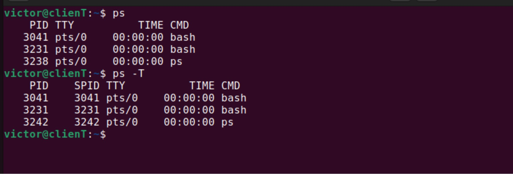

