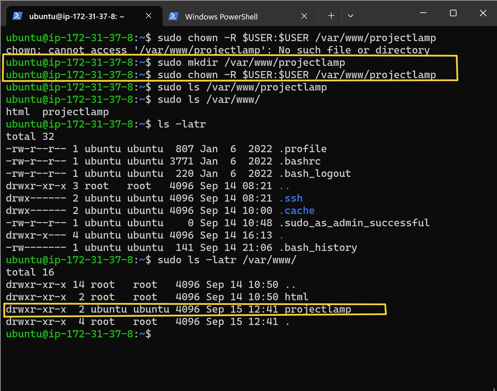

# WEB STACK IMPLEMENTATION (LAMP STACK) IN AWS.
## Deploying a LAMP Stack Web Application on AWS.

### Goal
Goal and aim of this project is to set up and configure a web development environment using the LAMP stack, which stands for Linux, Apache, MySQL, and PHP. The LAMP stack is a popular combinatiion of open-source software that provides a robust and scalable platform for hosting dynamic websites and web applications. 

### **Pre-Requisites**

1. AWS account free tier account or any other cloud provider like Azure etc.

2. Create an EC2 instance in AWS or virtual machine in azure or a virtual machine from any other cloud provider of your choice.  

3. Command line terminal (example, terminal, command prompt or shell, Git Bash).

4. Some Knowlege about SSH, prior knowledge about how to SSH into a virtual/remote host/server. 

## Definition of terms :

A LAMP stack is a popular open-source software stack used for web development. The acronym "LAMP" stands for the four key components that make up the stack:

**Linux:** This is the operating system on which the other components of the stack run. Linux is chosen for its stability, security, and open-source nature.

**Apache:** Apache HTTP Server is a widely-used web server software. It's responsible for handling incoming web requests, serving web pages, and managing the communication between the web server and web browsers.

**MySQL:** MySQL is a relational database management system (RDBMS) that stores and manages the data used by web applications. It's known for its speed, reliability, and scalability.

**PHP:** PHP (Hypertext Preprocessor) is a server-side scripting language that is used for building dynamic web applications.

# Preparing My Prerequisites 

### Create an EC2 Instance in AWS 
I am going to log into my AWS account and Click on EC2 instance to create an instance that will server as my virtual/remote server. 

Before creating EC2 instance first sellect the region closest to you, as I am in Bristol England I selected Europe(London). while creating an instance in AWS, choose create new Keypair and download **private private key(.pem)** on your local computer and make sure you keep that save and don't share it with anyone.

**IMPORTANT NOTICE** : Save your private key **(.pem file)** securely and do not share it with anyone! If you lose it, youn will not be able to connect to your server ever again.

**Remotely Connect (SSH) into your EC2 Instance (Virtual Server)**  

On your terminal (GitBash, windows terminal etc) depending on which type of terminal you are using, here I am using my windows terminal so on my windows terminal I will `cd` into the directory containing the downloaded private key and run the command below inserting my private key and my EC2 username and IP address or public DNS in the command to log into the intstance via SSH :

`ssh -i <private-keyfile-name>.pem username@<public-IP-address>`

in this case I used the public DNS resulting to the below command :

`ssh -i "Project3.pem" ubuntu@ec2-3-10-150-56.eu-west-2.compute.amazonaws.com`

# Intalling Apache and Updating the Firewall. 

Installing Apache and Updating the Firewall. 

Since I have succesfully connected to my EC2 through SSh, before I can go on to install any packages I will first have to update my ubuntu server using the command below: 

`sudo apt update`

Next is to run apache2 package installation using the command below :

`sudo apt install apache2`

Then we also need to check and verify that apache2 is running as a Service in our OS, using the command below: 

`sudo systmectl status apache2`

Now that I that it is green and running, then this means tha I did everything correctly and I have just launched a Web Server in the cloud (AWS cloud).

## Configuring Security Group Inbound Rules on EC2 Instance

As we have been able to ssh into our EC2 server via ssh making use of port 22 which is open by default once an ec2 instance is craeated in AWS. To be able to access our apeche  webs page over the internet,we need to edit inbound rule and open TCP port 80 (http)

By doing this and if my server is running, I can now access it locally and from the internet. (source 0.0.0/0 means 'from any IP address)

To check the accessiblity of our web server on the internet, we `curl` the IP address/DNS name of our localhost.

curl http://127.0.0:80 or curl http://localhost:80

Now that I have confirmed that the web server can be accessed from the internet, Now is time for me to check if and how my Apache HTTPserver can responed to requests from the internet. I will open a browser of my chioce and try to access the following url:

http:// Public-IP-Address:80

On seeing the apache webpage above I now know that my webserver can recieve request from the internet.

## Installing MySQL
now that I have a web server up and running, Next is to install MYSQL (Database Management System DBMS). This will enable me to store and manage data for site in a relational database. 

I will use the following command bellow to install MySQL server:

`sudo apt install mysql-server`

I have succesfully installed MySQL , next is for me to log into MySQL console by using the command below :

`sudo mysql`

Once I loged into MySQL it is recommended that I run a security script that comes pre-installed with MySQL. This script will remove some insecure default settings and lock down accesss to my database system.

Also before running the script it is also highly recommended that I have to set a password for the **root** user, using mysql_native_password as default authentication method.

 Using the followiing command to set the root password : 

`ALTER USER 'root'@'localhost' IDENTIFIED WITH mysql_native_password BY 'PassWord.1';`

After that I will exit MySQL shell with the command below: 

`exit`

To start the interactive script I will run the following :

`sudo mysql_secure_installation`

After all the security settings MySQL immediately respects the changes you have made. 

I finished all the settings I also test if I am able to log into the MySQL console by using the following command below :

`sudo mysql -p`

Notice something in the command above , the -p flag in the command will prompt you for the password used after changing the root user password. 

MySQL server is now installed and secured. Next, we will install PHP, the final component in the LAMP stack.

# Installing PHP
Now that I Apache installed tpo server my content and MSQL installed to store and manage my data. PHP is also the component of our and it is the programming language which is useful for dynamically displaying contents of the webpage to users who make requests to the webserver.

Also while installing **PHP** I need to install alongside someother packages like  **php-mysql** a PHP that allows PHP to communicatate with MySQL-based databases.

 I will also need **libapache2-mod-php** which allows Apache to interpret and execute PHP scripts, enabling the server to serve dynamic web content.

Inother to install thses 3 packages at once, I will run the following command below:

`sudo apt install php libapache2-mod-php php-mysql`

To check the version of PHP that was installed I will run the following command :

`php -v`

So far I have been able to complete the installation of LAMP stack which I listed below

- Linux(ubuntu)
- Apache HTTP Server
- MySQL
- PHP

### Creating a Virtual Host for my Website Using Apache (to test my setup with a PHP script)
Next is to set a **Apache Virtual Host**, Generally virtual host enables us to host multiple websites on our single server by holding our websites files and folders. so therefore I can be able to test  my setup with PHP script.

#### Craeting a Domain for our website.

Since Apache server serve website content through server blocks which are located in **www/var/** directory and Apache can support multiple of this server blocks to host other websites.

So in this project I will need to create my own domain(directory) and call it **projectlamp** inside the **www/var** directory using the following command below:

`sudo mkdir var/www/projectlamp`

For security reasons I will have change the ownership of the directory to current system user : 

`sudo chown -R $USER:$USER /var/ww/projectlamp`

All the files related to this websites will be contained in the projectlamp directory/domain as it now serves as a **new sever block** on the apache webserver. I also need to configure my server block before it can be spined up, and to this I will be needing a **.conf** file.

creating a **.conf** file with the following command below: 

`sudo vi /etc/apache/sites-available/projectlamp.conf`

To save and close the file first hit `esc` then type `:wq` and then hit` enter` on your keyborad.

With this VirtualHost configuration above , I am telling the Apache to serve **projectlamp** using /var/www/projectlamp as it's web root directory. 

Now I need to enable the new virtula host using the follwing command: 

`sudo a2ensite projectlamp`

I also need to disable the Apache's default website so as to stop it from overwriting our virtual host. I will do that by running the command below :

`sudo a2dissite 000-default`

To check and make sure my configuration file contain no syntax errors :

`sudo apache2ctl configtest`

To reload Apache so as the changes that I made will take effect :

`sudo systemctl reload apache2`

Now my website is active and my web root **/var/www/projectlamp** is still empty. At this piont I will create an index.html file in that location so that I can test and see that the virtul host works as expected, I will do that by running the following commad :

`sudo echo 'Hello LAMP from hostname' $(curl -s http://169.254.169.254/latest/meta-data/public-hostname) 'with public IP' $(curl -s http://169.254.169.254/latest/meta-data/public-ipv4) > /var/www/projectlamp/index.html`

Now I will go to my browser and open the webpage using the IP Address as follows :

`http//<public-IP-Address>:80`

I can also use the DNS name to open the webpage as follows :

`http://<Public-DNS-Name>:80`

Based on default settings, the webserver always has a preference for serving an index.html file based on the order of precedence by default in the DirectoryIndex settings of Apache.

To serve an index.php containing the server-side code, you’ll need to edit the **/etc/apache2/mods-enabled/dir.conf** file and change the order in which the **index.php** file is listed within the DirectoryIndex as follows: 

`sudo vim /etc/apache2/mods-enabled/dir.conf`

I will then create a new file named **index.php** inside my custom web root folder by running the following command :

`vim /var/www/projectlamp/index.php`

After I finished creating  **index.php** file above I then input the  instance/server public address on the web browser. 

