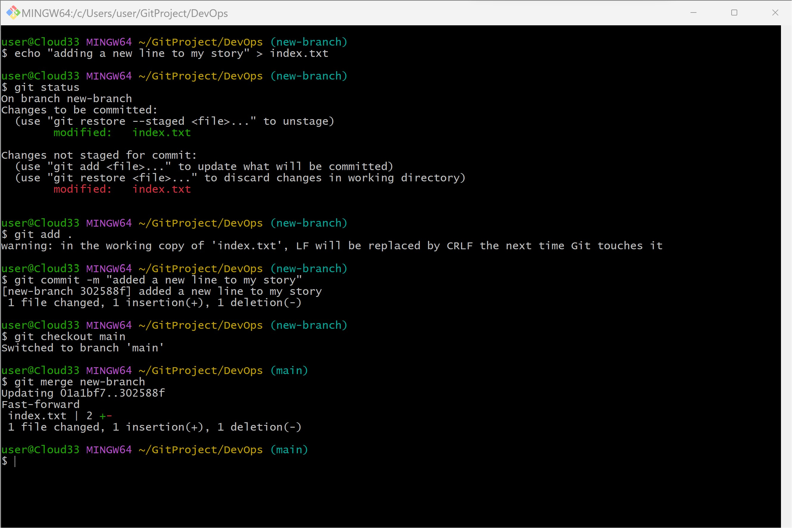
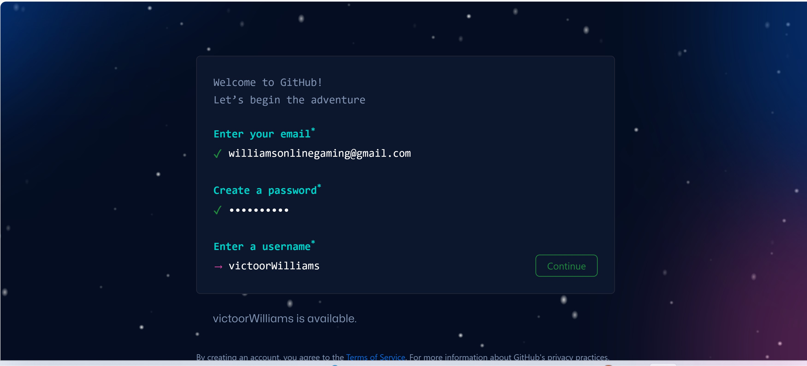
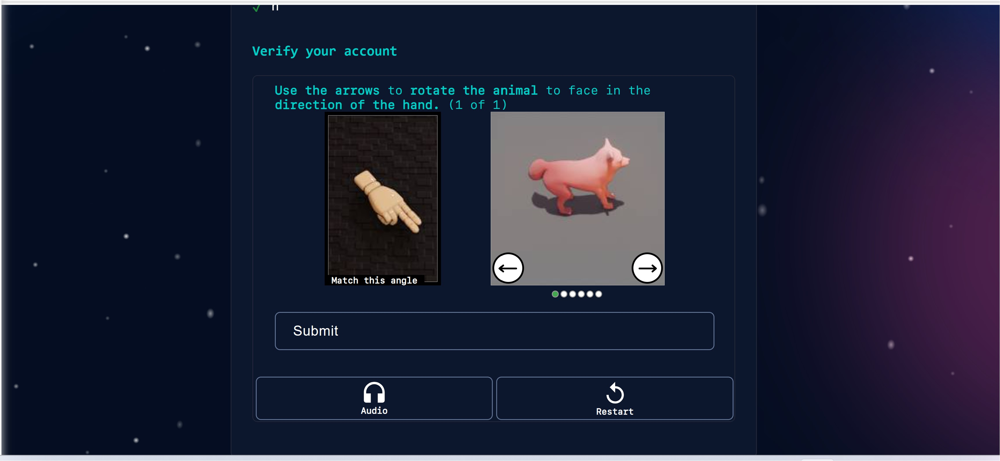
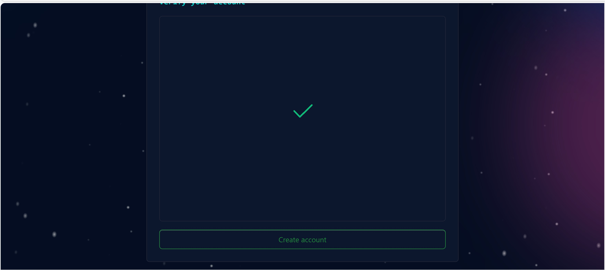
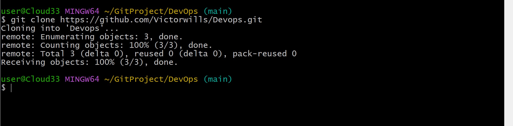

# GIT PROJECT 

# Pre-requisite

1. Git Bash
2. Github account
3. Visual studio Code 

#### Git :
 Git is a distributed version control system. Git essesntially solves the problem of sharing source code efficiently and keeping the changes that was made. Git allows developers to make their own copy of the central reppositroy that is why it is refered to as Distributed Version Control System. 
 #### GIt bash : 
 Git Bash is a command-line interface (CLI) and terminal emulator for Windows that provides a Unix-like environment. It allows users to interact with the Git version control system and run Unix-like commands on their Windows machines.
 #### Github account 
A GitHub account is an online user account that is created on the GitHub platform, which is a web-based platform for version control and collaboration on software development projects.
#### Visual studio code (VS Code) 
Visual Studio Code (VS Code) is a free, open-source code editor developed by Microsoft. It is designed for developers and programmers and is used for writing, editing, and debugging code across a wide range of programming languages and development platforms.

## Initializing a Git Repositroy 

Before initializing a git repository you must make sure that you have already intsalled git in you computer. To install git incase you havn't done that before, click on the following link. https://git-scm.com/downloads and make sutre to sellect the right operating system you are using(windows, macOS, linux/Unix)

 

#### Now to initialize a git repo after intsalling a git follow  these steps : 
- open a terminal on your working folder or directory eg Devops folder using this command below 

`mkdir DevOps`
- Change or move into your working directory or folderusing this command 

`cd Dveops`
- While you are inside the folder, run this command below to initialize git.

`git init`

 

 ### Making your first Commit 

 Commit is more or less saving the saving the changes you made to files. Changes can be adding, modifying or deleting files or text.

 When you make a commit, git takes a snapshot of the current state of your repository and saves a copy in the .git folder inside your workind directory. 

 Now lets make our first commit by following thses steps:

 - Inside your working directory create a file index.txt using this command below :

`touch index.txt`  

- Write any sentences of your choice inside the text file. Afterwards, save your changes. 

- Add your changes to git staging area using this command below :

`git add .`

- To commit your changes to git, run the command below :

`git commit -m "initial commit"` 

where -m stands for commit message (which is "initial commit" in this case)

#### Note
The commit message is a nice way to provide context about the commit. When writing a commit message, make it descriptive as possible. Let it explain why the commit was made.

# Working with Branches 
Git branch helps you to create a different copy(page) of your source code. In your new branch you can make changes as you please. Your change is independent of what is avilable in the main copy.

## Make your first git Branch

To make a new barnch we run this command :` git checkout -b `

where -b helps to create new branch and checkout enables us to chnage into the new branch. 

### Now lets make our first branch following these steps : 

- having made my first commit in the previous lesson 

- make a new branch by running this command below :

`git checkout -b new-branch`

### Listing Your git Branch 
use the command below to list the barnches on your local git repository : 

`git branch`

### Changing into Old Branch
to change into an exiting or old branch the general syntax command is as below:

`git checkout <branch-name>`

with our branch name in this project the command to use now becomes as follows:

`git checkout main`

## Merging a Branch into another Branch

now that we have two branches which are "main" and "new-branch". Lets merge (ie. add the conetnt of new-branch to main) our new-branch to our main .

first we have to  change into our "main" branch and run the git command below:

`git merge new-branch` 

### Deleting git branch

When new feature is added to an application, its often done in a feature branch. Usually this feature branch is deleted when the code must havde tested and merged into a staging or dev environment depending on the branch strategy of the team. 

Git branch can be deleted with the commnand syntax below :

`git branch -d <branch_name>`

using our branch name "new-branch" in this project, then our command will be as follows :

`git branch -d new-branch`

# Collaboration and Remote Repositories

As we already learnt that git is a distributed version control system which essentially solves the problem of sharing source code and tracking changes made to source code.

 Then come to think of it how can devlopers working remotely collaborate(making changes, adding, updating etc) on the same code base since we currently have our code in our local computer.

  This is where **github** comes in, Git hub is a web based platfrom where git repositories are hosted. by hosting our local git repository on github, it becomes available in the public internet(also posible to create private repository as well) which anyone can now access it.

  With **github** Remote teams can now view, update, and make chnages to the same repository.

## Creating Github Account

step 1: head over to (https://github.com)

step 2: Next enter your username, password, and email

step 3: Next solve the puzzle following the instruction click on the submit buttom to verify.

step 4: Next click on the Create button to create your account. 

step 5: An activation code will be sent to your email, enter the code in textboxes provided then click continue.

step 6: select your preferences and click continue.

step 6: A list of github plans wiil be shown to you. Click contnue fro free

## Creating Your First Repository

step 1: click on the plus sign at top right corner of your github account. A drop down will appear, select new repository 

step 2: fill out the form by adding a unique repository name,description and ticking the box to add a Readme.md file

step 3: Click the green button below to create your repository.

## Pushing your local git repository to your Remote Github Repository. 

Having created a github account and a github repository in earleir steps, Lets send a copy of our repositpory in github.

We will achieve this by following the steps bellow:

- Add a remote repository to the local repository using the command below :

`git remote add origin <link to your gitub repo>`

to get the remote link click on the green button code, copy the https link. As seen in the screenshot below. 

- After commiting your changes in your local repo. You push the content to the remote repo using the command below : 

`git push origin <branch name>` 

which in this project our branch name is "main" then the command becomes as follows:
 
`git push origin main`

## Cloning Remote Git Repository

`git clone <link to your remote repository>`

## Branch Management and Tagging 

### Introduction to Markdown Syntax 
Markdown syntax is a lightweight markup language that is widely used for formatting plain text. It allows you to add formating elements to your text without using complex HTML or other formatting languages. Markdown is commonly used for creating documents, README files, forum posts, and even web pages.

1. ## Headings: 
To create heading, use the hash symbol at the beginning of the line. The number of hash symbol used indicate the level of the heading.

code is below :

`# Heading 1`

`## Heading 2`

`### Heading 3`

## Preview 

2. ## Emphasis: 
asterisks or underscore is used to Emphasis text 

code: 

`*italic* or _italic_`

`**bold** or __bold__` 

## Preview 

3. ## Lists:
Markdown has supported for both ordered and unorderd list 

#### unordered list example:

`- Item 1`

`- Item 2`

`- Item 3`

## Preview

#### ordered list example code 
`1. First item`

`2. Second item `

`3. Third item `

## Preview 

4. #### Links::
 To create hyperlink, use square brackets for the link text followed by parentheses containing the URL 

code :

`[visit darey.io](https://www.darey.io)`

## Preview 

5. #### Images :
To display an iamge, use an exclamation mark followed by the square brackets for the alt text and parentheses containing the image URL

``

6. #### Code:
To display code or code snippets, use backticks (``) to enclose the code 

`console.log('Welcome to darey.io')`

